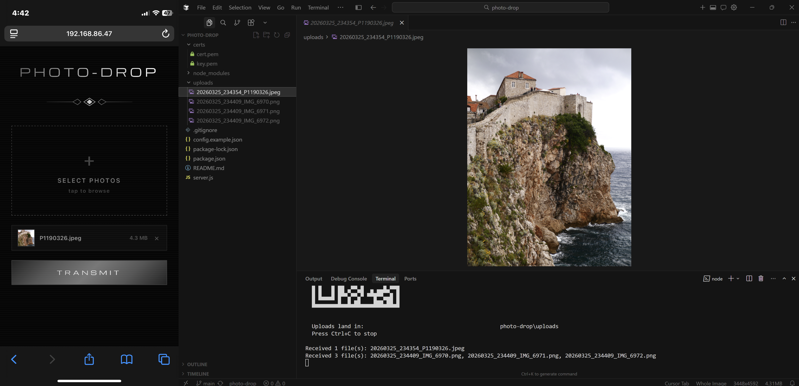

# photo-drop

Local HTTPS server for transferring photos from an iPhone to a Windows laptop over WiFi. No apps, no accounts, no subscriptions — just Safari on the phone.



## Why This Exists

Take photos on an iPhone, get them onto a Windows laptop for 3D modeling in Blender. No iCloud login, no third-party apps, no paid services. Just a local server you run when you need it.

## Prerequisites

- [Node.js](https://nodejs.org/) v18 or later
- Both devices on the **same WiFi network**

## Quick Start

```bash
git clone https://github.com/martyna1221/photo-drop.git
cd photo-drop
npm install
npm start
```

The terminal will display a URL, a QR code, and a 4-digit PIN.

## Windows Firewall (one-time setup)

On first use, Windows Firewall will block incoming connections to the server. photo-drop tries to configure this automatically, but if it can't (non-admin terminal), you'll see a warning. Run these two commands **once** in an elevated (Run as Administrator) PowerShell:

```powershell
netsh advfirewall firewall add rule name="photo-drop (port 3333)" dir=in action=allow protocol=TCP localport=3333
netsh advfirewall firewall set rule name="Node.js JavaScript Runtime" dir=in profile=private new enable=no
```

You only need to do this once — the rules persist across reboots.

**What these commands do:**

1. **Allow port 3333** — Creates an inbound firewall rule that permits TCP traffic on port 3333. This is the only port photo-drop uses.
2. **Disable the Node.js block rule** — When Node.js is first run, Windows often creates a blanket "Block" rule for it on Private networks. This rule silently drops all inbound connections to any Node.js process, overriding port-specific Allow rules (Block always wins in Windows Firewall). Disabling it lets the port 3333 Allow rule take effect.

See the [Security](#security) section below for implications and how to reverse these.

## Usage

1. Run `npm start` on your laptop
2. On your iPhone, scan the QR code from the terminal (or type the URL into Safari)
3. Safari will show a certificate warning — tap **Advanced > Continue** (this is expected with self-signed certs)
4. Enter the 4-digit PIN shown in the terminal
5. Select photos and tap **Transmit**
6. Photos appear in the uploads folder on your laptop

A new PIN is generated every time the server starts. The TLS certificate is generated once and reused.

## Configuration

Optionally create a `config.json` in the project root to customize the upload directory:

```json
{
  "uploadsDir": "C:/Users/you/Desktop/scans"
}
```

Relative paths resolve from the project root. If no config file exists, uploads go to `./uploads/`.

See `config.example.json` for the template.

## Architecture

Single-file Node.js server (`server.js`). No build step, no frontend framework.

```
server.js
  ├── loadConfig()   — reads optional config.json
  ├── getCert()      — generates/loads TLS cert from ./certs/
  ├── getLocalIP()   — detects local WiFi IP, prefers Wi-Fi adapters
  ├── PIN + session  — random 4-digit PIN, HMAC-based session cookie
  ├── Express routes
  │   ├── GET  /       — PIN entry page (redirects to /upload if authed)
  │   ├── POST /auth   — validates PIN, sets session cookie
  │   ├── GET  /upload — upload page (requires auth)
  │   └── POST /upload — handles file upload via multer (requires auth)
  ├── Firewall       — auto-adds/removes Windows Firewall rule
  ├── HTTPS server   — binds to 0.0.0.0:3333
  └── HTML pages     — embedded as template literals (pinPage, uploadPage)
```

## Dependencies

- `express` — HTTP server
- `multer` — multipart file upload handling
- `selfsigned` — generates self-signed TLS certificates without needing openssl CLI
- `qrcode-terminal` — prints a scannable QR code in the terminal

All are lightweight, no recurring costs.

## Project Structure

```
photo-drop/
  .gitignore           # excludes node_modules/, uploads/, certs/, config.json
  package.json
  server.js            # the entire application
  config.example.json  # template for optional config
  README.md            # this file
  certs/               # auto-generated TLS cert + key (gitignored)
  uploads/             # where photos land (gitignored)
```

## Key Details

- **Port:** 3333 (hardcoded in server.js)
- **Max file size:** 50 MB per file
- **Max files per upload:** 20
- **Filename format:** `YYYYMMDD_HHmmss_originalname.ext` — timestamp prefix prevents collisions
- **Unsafe filename chars** are replaced with underscores
- **Cert persistence:** TLS cert is generated once and saved to `./certs/`. Deleted certs are regenerated on next start
- **IP detection:** Prefers interfaces named "Wi-Fi" / "Wireless", deprioritizes virtual adapters (WSL, Hyper-V, VirtualBox, Docker, VMware). If the QR code URL doesn't work, check `ipconfig` and use the correct IP manually
- **No database:** Files go straight to disk, no metadata stored
- **Same-WiFi only:** Both devices must be on the same local network. The server binds to the laptop's local IP, which is not reachable over cellular data or from a different network

## Security

### What's protected

- **TLS encryption** — All traffic is HTTPS. A network sniffer on the same WiFi sees encrypted packets, not photo contents. The self-signed cert triggers a one-time Safari warning, which is expected and safe since you are the server.
- **PIN gate** — A random 4-digit PIN is generated each time the server starts and printed only in the terminal. Without the PIN, the upload page is inaccessible. The PIN is validated server-side (not just client-side). The session cookie is `HttpOnly`, `Secure`, `SameSite=Strict`.
- **File size limit** — 50 MB per file via multer config.

### Firewall implications

**Opening port 3333:**
The firewall rule allows any device on your local network to reach port 3333. This is **not** internet-facing — your router's NAT keeps it LAN-only. The risk is limited to other devices on your WiFi. If you're on a trusted home network, this is low risk. If you're on a shared/public network, anyone on that network could attempt to connect (they'd still need the PIN).

If you want to tighten this up, you can delete the firewall rule when you're not using photo-drop:

```powershell
netsh advfirewall firewall delete rule name="photo-drop (port 3333)"
```

**Disabling the Node.js Block rule:**
The second firewall command disables the Windows-generated "Node.js JavaScript Runtime" Block rule on Private networks. This affects **all** Node.js processes on your machine, not just photo-drop — any Node.js server you run will be able to accept inbound connections on Private networks. If you only run trusted Node.js applications, this is fine. If you want to re-enable the block:

```powershell
netsh advfirewall firewall set rule name="Node.js JavaScript Runtime" dir=in profile=private new enable=yes
```

### What's not in scope

- Protection against attackers who have already compromised the local machine
- Active MITM attacks (unlikely on a home network; Safari warns about cert changes)
- PIN brute-force: 10,000 possible combinations, but the server is local-only and the PIN regenerates every restart, making automated attacks impractical

## Known Limitations

- **HEIC format:** iPhones shoot in HEIC by default. The server accepts any file type, but downstream tools (e.g., Blender) may not open HEIC directly. A future enhancement could auto-convert to PNG/JPEG.
- **Multiple network interfaces:** If the machine has several adapters (common with WSL, VPNs, Docker), `getLocalIP()` may not pick the right one. If the QR code URL doesn't work, check `ipconfig` and use the correct IP manually.
- **Safari cert warning:** Happens once per cert. If you delete `./certs/` and regenerate, you'll need to accept the warning again.
- **No file browsing:** There's no UI to view previously uploaded files from the phone. Files are only accessible from the laptop's filesystem.

## Roadmap

- Accept documents (PDF, etc.) in addition to photos
- Auto-convert HEIC to PNG/JPEG
- Thumbnail gallery of uploaded files on the upload page
- CLI args for custom port and output folder
- Drag-and-drop on the web UI
- Upload history / re-download from the phone

## License

MIT
